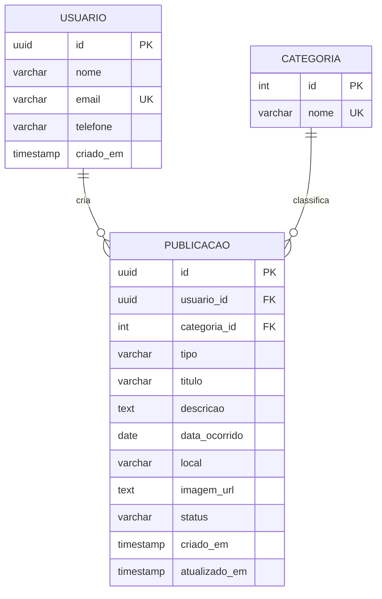

# 5. Modelagem de Dados — DER

## Entidades do MVP

### USUARIO

| Atributo | Tipo sugerido | Regra |
|---|---|---|
| id | UUID | PK |
| nome | VARCHAR(120) | Obrigatório |
| email | VARCHAR(160) | Obrigatório e único |
| telefone | VARCHAR(20) | Meio de contato |
| criado_em | TIMESTAMP | Data de criação |

### CATEGORIA

| Atributo | Tipo sugerido | Regra |
|---|---|---|
| id | INTEGER | PK |
| nome | VARCHAR(60) | Obrigatório e único |

Exemplos: Documentos, Eletrônicos, Acessórios, Material Escolar, Roupas e Outros.

### PUBLICACAO

| Atributo | Tipo sugerido | Regra |
|---|---|---|
| id | UUID | PK |
| usuario_id | UUID | FK → USUARIO.id |
| categoria_id | INTEGER | FK → CATEGORIA.id |
| tipo | VARCHAR(10) | PERDIDO ou ENCONTRADO |
| titulo | VARCHAR(120) | Obrigatório |
| descricao | TEXT | Obrigatório |
| data_ocorrido | DATE | Obrigatório |
| local | VARCHAR(160) | Obrigatório |
| imagem_url | TEXT | Opcional |
| status | VARCHAR(10) | ATIVA ou RESOLVIDA |
| criado_em | TIMESTAMP | Data de criação |
| atualizado_em | TIMESTAMP | Última atualização |

## Relacionamentos

- Um **USUARIO** pode criar **0..N PUBLICACOES**.
- Cada **PUBLICACAO** pertence a **1 USUARIO**.
- Uma **CATEGORIA** pode classificar **0..N PUBLICACOES**.
- Cada **PUBLICACAO** pertence a **1 CATEGORIA**.

## DER em Mermaid

Os arquivos visuais e editáveis do DER estão disponíveis em `docs/diagramas/`:

- `der-campusfind.svg`
- `der-campusfind.dot`
